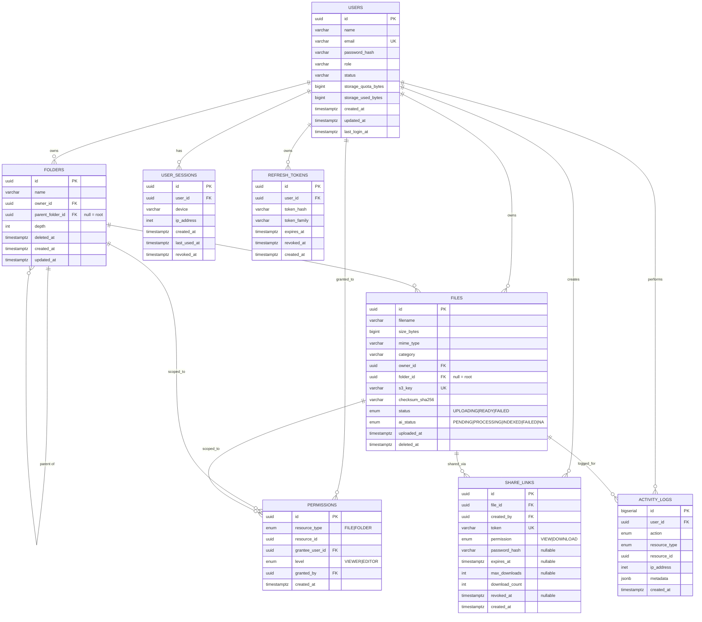

# NimbusVault — Database Design Document

| Field | Value |
|---|---|
| Document | Phase 0 · Relational Schema & ER Model |
| Engine | PostgreSQL 16 (accessed via Prisma ORM) |
| Version | 2.0 (Hardened) |
| Conventions | snake_case tables/columns; UUID v4 primary keys (except append-only logs); `created_at/updated_at` on all mutable tables |

## 1. Design Principles

1. **Metadata only.** Binary file content lives in S3; PostgreSQL stores pointers (`s3_key`) and searchable attributes. The database never holds blobs.
2. **Soft deletes.** `deleted_at` timestamps implement Trash; a background purge enforces the 30-day retention window.
3. **Integrity in the database, not just the app.** Foreign keys, uniqueness constraints, CHECK constraints and enums are declared at schema level so bugs cannot corrupt data even if application validation fails.
4. **Query-shaped indexing.** Every index corresponds to a documented access path from the API contract — no speculative indexes.
5. **Audit by default.** Activity logs capture every mutation with user, resource, IP, and timestamp for security review and debugging.

---

## 2. ER Diagram

---

## 3. Table Specifications

### 3.1 `users` (Enhanced)

**Purpose.** Identity, credentials, storage accounting, and session management for every account.

| Column | Type | Constraints | Notes |
|---|---|---|---|
| `id` | UUID | PK, default `gen_random_uuid()` | Public identifier used in APIs |
| `name` | VARCHAR(80) | NOT NULL | Display name |
| `email` | VARCHAR(255) | NOT NULL UNIQUE (stored lowercase) | Login identifier; case-insensitive uniqueness enforced via CITEXT or lower() unique index |
| `password_hash` | VARCHAR(72) | NOT NULL | bcrypt output only — never plaintext |
| `role` | VARCHAR(20) | NOT NULL DEFAULT `'user'` | `'user'`, `'admin'` — for future RBAC |
| `status` | VARCHAR(20) | NOT NULL DEFAULT `'active'` | `'active'`, `'suspended'`, `'deleted'` |
| `storage_quota_bytes` | BIGINT | NOT NULL DEFAULT 5 GB | Per-user ceiling |
| `storage_used_bytes` | BIGINT | NOT NULL DEFAULT 0, CHECK ≥ 0 | Denormalized counter maintained transactionally |
| `last_login_at` | TIMESTAMPTZ | NULLABLE | Updated on successful login |
| `created_at`, `updated_at` | TIMESTAMPTZ | NOT NULL, defaults now() | Audit |

- **Relationships:** 1→N to `folders`, `files`, `share_links`, `permissions`, `activity_logs`, `user_sessions`, `refresh_tokens`.
- **Constraints:** email uniqueness is the registration guard; quota check happens in application logic using an atomic conditional update.
- **Indexes:** `UNIQUE(email_lower)`. That's sufficient — login is the only lookup by email.

**Changes from Phase 1:**
- Added `role` for future admin capabilities
- Added `status` for account lifecycle management
- Added `last_login_at` for security audit and inactive account detection

### 3.2 `folders`

**Purpose.** Hierarchical organization containers for files and sub-folders.

| Column | Type | Constraints | Notes |
|---|---|---|---|
| `id` | UUID | PK | |
| `name` | VARCHAR(255) | NOT NULL | Validated: no `/`, no leading/trailing whitespace |
| `owner_id` | UUID | NOT NULL FK → users(id) ON DELETE CASCADE | A folder has exactly one owner |
| `parent_folder_id` | UUID | NULLABLE FK → folders(id) ON DELETE CASCADE | NULL = user root; self-reference enables nesting |
| `depth` | INT | NOT NULL DEFAULT 0 | Root=0; denormalized to cheaply enforce max-depth cap (20) and cycle checks |
| `deleted_at` | TIMESTAMPTZ | NULLABLE | Soft delete / trash |
| `created_at`, `updated_at` | TIMESTAMPTZ | NOT NULL | |

- **Relationships:** self-referencing tree; 1→N `files`; 1→N `permissions`.
- **Constraints:** `UNIQUE(owner_id, parent_folder_id, name)` where not deleted — sibling-name uniqueness per owner. Cycle prevention: moving folder X under Y requires walking Y's ancestor chain (bounded by `depth ≤ 20`) and rejecting if X appears.
- **Indexes:** `(owner_id, parent_folder_id)` covers the dominant "list children" query; FK indexes on `parent_folder_id`.

**Hierarchy strategy:** adjacency list (this table). Chosen over materialized path/Nested Sets because moves are O(1) updates here, and our depth cap keeps recursive traversals cheap. Revisit only if deep-tree analytics become a feature.

### 3.3 `files` (Enhanced)

**Purpose.** Metadata record for each stored object; the join point between users, folders, S3, sharing and AI indexing.

| Column | Type | Constraints | Notes |
|---|---|---|---|
| `id` | UUID | PK | Referenced by share links, permissions, AI jobs |
| `filename` | VARCHAR(255) | NOT NULL | Original name, user-renameable |
| `size_bytes` | BIGINT | NOT NULL CHECK ≥ 0 | Verified against S3 HEAD on finalize |
| `mime_type` | VARCHAR(127) | NOT NULL | e.g. `application/pdf` |
| `category` | ENUM | NOT NULL: `pdf, image, video, document, other` | Denormalized from mime_type to make filter queries index-friendly |
| `owner_id` | UUID | NOT NULL FK → users(id) ON DELETE CASCADE | |
| `folder_id` | UUID | NULLABLE FK → folders(id) ON DELETE SET NULL | File survives folder hard-delete as root-level orphan |
| `s3_key` | VARCHAR(512) | NOT NULL UNIQUE | Format: `users/{ownerId}/{yyyy}/{mm}/{uuid}.{ext}` — owner-namespaced, collision-proof |
| `checksum_sha256` | CHAR(64) | NULLABLE | **Integrity + future dedupe** — verified at finalize; enables future content-addressable storage |
| `status` | ENUM | NOT NULL DEFAULT `UPLOADING`: `UPLOADING, READY, FAILED` | Two-phase upload state machine |
| `ai_status` | ENUM | NOT NULL DEFAULT `NA`: `PENDING, PROCESSING, INDEXED, FAILED, NA` | Mirrors AI pipeline progress; NA for non-text types |
| `uploaded_at` | TIMESTAMPTZ | NOT NULL DEFAULT now() | Distinct from created_at conceptually; equals it in practice |
| `deleted_at` | TIMESTAMPTZ | NULLABLE | Soft delete |

- **Relationships:** N→1 `users`; optional N→1 `folders`; 1→N `share_links`, `permissions`, `activity_logs`.
- **Constraints:** `s3_key` UNIQUE prevents duplicate object registration; size CHECK blocks negative-accounting bugs.
- **Indexes:**
  - `(owner_id, deleted_at, uploaded_at DESC)` — trash listing & recent files
  - `(owner_id, folder_id, deleted_at)` — browse-folder query
  - `GIN gin_trgm_ops(filename)` — filename substring search (Phase 1)
  - `(owner_id, category)` — type filter

**Checksum Purpose:**
- **Integrity verification** — verified at finalize against S3 object; detects corruption during transfer
- **Duplicate detection** — future feature: content-addressable storage prevents storing identical files multiple times
- **Integrity auditing** — periodic reconciliation jobs can re-verify checksums against S3

### 3.4 `share_links`

**Purpose.** Capability tokens granting controlled public access to one file without an account.

| Column | Type | Constraints | Notes |
|---|---|---|---|
| `id` | UUID | PK | Internal handle for revocation API |
| `file_id` | UUID | NOT NULL FK → files(id) ON DELETE CASCADE | Link dies with its file |
| `created_by` | UUID | NOT NULL FK → users(id) | Audit: who shared |
| `token` | VARCHAR(64) | NOT NULL UNIQUE | 128-bit CSPRNG base64url; opaque — never derived from `file_id` |
| `permission` | ENUM | NOT NULL: `VIEW, DOWNLOAD` | VIEW forbids download endpoint |
| `password_hash` | VARCHAR(72) | NULLABLE | bcrypt; NULL = no password |
| `expires_at` | TIMESTAMPTZ | NULLABLE | NULL = never expires (discouraged default off) |
| `max_downloads` | INT | NULLABLE | Optional usage cap |
| `download_count` | INT | NOT NULL DEFAULT 0 | Incremented atomically per redemption |
| `revoked_at` | TIMESTAMPTZ | NULLABLE | Set = instantly dead regardless of expiry |
| `created_at` | TIMESTAMPTZ | NOT NULL | |

- **Relationships:** N→1 `files`; N→1 `users` (creator).
- **Validity predicate:** `revoked_at IS NULL AND (expires_at IS NULL OR expires_at > now()) AND (max_downloads IS NULL OR download_count < max_downloads)` — enforced in one indexed lookup on `token`.
- **Indexes:** `UNIQUE(token)` (redemption path); `(file_id)` for "list links for this file".

### 3.5 `permissions`

**Purpose.** Explicit grants letting *other* users view/edit a specific file or folder (team collaboration model). Ownership is implicit via `owner_id`; this table covers non-owner grants only.

| Column | Type | Constraints | Notes |
|---|---|---|---|
| `id` | UUID | PK | |
| `resource_type` | ENUM | NOT NULL: `FILE, FOLDER` | Polymorphic target |
| `resource_id` | UUID | NOT NULL | FK resolved per resource_type (enforced in service layer; polymorphic FKs aren't native to SQL) |
| `grantee_user_id` | UUID | NOT NULL FK → users(id) ON DELETE CASCADE | Who receives access |
| `level` | ENUM | NOT NULL: `VIEWER, EDITOR` | VIEWER=read/preview/searchable; EDITOR=+rename/move/delete-within |
| `granted_by` | UUID | NOT NULL FK → users(id) | Audit |
| `created_at` | TIMESTAMPTZ | NOT NULL | |

- **Constraints:** `UNIQUE(resource_type, resource_id, grantee_user_id)` — one row per grantee per resource; re-granting updates rather than duplicates.
- **Authorization rule:** effective access = owner OR permission row exists with sufficient level. Folder grants cascade read down the subtree (walk bounded by depth cap).
- **Indexes:** `(resource_type, resource_id)` — "who has access"; `(grantee_user_id)` — "what can I access"; both feed the semantic-search allow-list filter.

### 3.6 `activity_logs`

**Purpose.** Append-only audit trail: who did what to which resource, when, from where. Powers security review and the UI activity feed. Never updated, rarely deleted (retention 12 months).

| Column | Type | Constraints | Notes |
|---|---|---|---|
| `id` | BIGSERIAL | PK | Sequential — high insert throughput, natural chronological order |
| `user_id` | UUID | NULLABLE FK → users(id) ON DELETE SET NULL | NULL for anonymous share-link hits; SET NULL preserves history after account deletion |
| `action` | ENUM | NOT NULL: `auth.login, auth.failed_login, auth.logout, auth.password_change, file.upload, file.download, file.delete, file.restore, file.rename, file.move, folder.create, folder.delete, share.create, share.revoke, share.access, ai.query` | Closed vocabulary simplifies dashboards |
| `resource_type` | ENUM | NULLABLE: `FILE, FOLDER, SHARE_LINK, USER` | |
| `resource_id` | UUID | NULLABLE | No FK deliberately — log must survive resource deletion |
| `ip_address` | INET | NULLABLE | Native Postgres type; IPv4/IPv6 aware |
| `metadata` | JSONB | NULLABLE | Flexible extras: `{filename, sizeBytes, userAgent, tokenPrefix}` |
| `created_at` | TIMESTAMPTZ | NOT NULL DEFAULT now() | |

- **Indexes:** `(user_id, created_at DESC)` — per-user feed; `(resource_type, resource_id, created_at)` — per-item history. BRIN on `created_at` if volume grows.
- **Growth plan:** partition monthly by `created_at` once > ~10M rows; writes are pure inserts so partitioning is transparent to callers.

### 3.7 `user_sessions` (New)

**Purpose.** Track active sessions for security audit, concurrent session management, and forced logout capability.

| Column | Type | Constraints | Notes |
|---|---|---|---|
| `id` | UUID | PK | |
| `user_id` | UUID | NOT NULL FK → users(id) ON DELETE CASCADE | |
| `device` | VARCHAR(255) | NULLABLE | User agent or device identifier |
| `ip_address` | INET | NULLABLE | |
| `created_at` | TIMESTAMPTZ | NOT NULL DEFAULT now() | Session start |
| `last_used_at` | TIMESTAMPTZ | NOT NULL DEFAULT now() | Updated on each request |
| `revoked_at` | TIMESTAMPTZ | NULLABLE | Set on logout or forced revocation |

- **Indexes:** `(user_id, revoked_at)` — active sessions query; `(last_used_at)` — stale session cleanup.
- **Use cases:** "View active sessions" UI, "Log out all devices", concurrent session limits, anomaly detection.

### 3.8 `refresh_tokens` (Enhanced)

**Purpose.** Secure storage of refresh token hashes with family tracking for rotation and replay detection.

| Column | Type | Constraints | Notes |
|---|---|---|---|
| `id` | UUID | PK | |
| `user_id` | UUID | NOT NULL FK → users(id) ON DELETE CASCADE | |
| `token_hash` | VARCHAR(72) | NOT NULL | bcrypt hash of raw token |
| `token_family` | UUID | NOT NULL | Groups rotated tokens; enables reuse detection |
| `expires_at` | TIMESTAMPTZ | NOT NULL | Absolute expiry |
| `revoked_at` | TIMESTAMPTZ | NULLABLE | Set on rotation, logout, or reuse detection |
| `created_at` | TIMESTAMPTZ | NOT NULL DEFAULT now() | |

- **Indexes:** `(user_id)` — user's tokens; `(token_family)` — rotation/revocation; `(expires_at)` — cleanup.
- **Rotation:** New token issued on each use; old token marked revoked. Reuse of revoked token → entire family revoked (theft detection).

---

## 4. Entity Relationship Summary

| Relationship | Cardinality | Enforcement |
|---|---|---|
| User → Folders | 1:N | FK `folders.owner_id` CASCADE |
| User → Files | 1:N | FK `files.owner_id` CASCADE |
| User → Sessions | 1:N | FK `user_sessions.user_id` CASCADE |
| User → Refresh Tokens | 1:N | FK `refresh_tokens.user_id` CASCADE |
| Folder → Sub-folders | 1:N (self) | FK `folders.parent_folder_id` CASCADE |
| Folder → Files | 1:N | FK `files.folder_id` SET NULL |
| File → Share Links | 1:N | FK `share_links.file_id` CASCADE |
| User ↔ Resource grants | M:N via `permissions` | Unique triple constraint |
| User → Activity | 1:N | FK `activity_logs.user_id` SET NULL |
| File → Activity | 1:N | Logical only (no FK) |

---

## 5. Transactional Integrity Scenarios

| Scenario | Strategy |
|---|---|
| Upload finalize | Single transaction: INSERT file row (status READY) + UPDATE users.storage_used_bytes with conditional `WHERE storage_used_bytes + $size <= storage_quota_bytes`; zero rows updated ⇒ quota exceeded ⇒ rollback + `413` |
| Concurrent same-name folder creation | UNIQUE(owner,parent,name) makes the second insert fail cleanly → mapped to `409` |
| Folder move race | Depth re-check inside the move transaction; ancestor walk rejects cycles |
| Share redemption counter | Atomic `UPDATE … SET download_count = download_count + 1 WHERE <validity predicate> RETURNING` — caps enforced without read-modify-write races |
| Delete + simultaneous share access | Redemption joins live file row; soft-deleted file ⇒ validity predicate fails ⇒ `404/410` |
| AI status transitions | Only the worker owning a job may advance `ai_status` (optimistic check on prior value) — avoids double-processing |
| Password change | Single transaction: UPDATE password_hash + DELETE FROM user_sessions WHERE user_id + DELETE FROM refresh_tokens WHERE user_id + log activity |

---

## 6. Data Retention & Lifecycle

| Data class | Retention | Mechanism |
|---|---|---|
| Active file metadata | Life of account | — |
| Trashed files/folders | 30 days | Nightly job: find `deleted_at < now()-30d` → delete S3 objects → purge rows |
| Orphaned S3 objects (upload abandoned) | 24 h | Nightly reconciliation: objects without READY rows are deleted |
| Share links | Until revoked/expired | Expired links pruned after 90 days |
| Activity logs | 12 months | Monthly partition drop |
| User sessions | Until revoked | Stale sessions (>30d inactive) cleaned nightly |
| Refresh tokens | Until revoked/expired | Revoked tokens purged after 90 days |
| Accounts | On deletion request | PII anonymized; activity rows retained with NULL user (audit continuity) |

---

## 7. Migration Strategy

| Aspect | Policy |
|---|---|
| Tooling | Prisma Migrate; every change is a timestamped SQL migration file committed with the code that needs it |
| Authoring rules | One logical change per migration · never edit an applied migration · forward-only (no down migrations in production) |
| Naming | `YYYYMMDDHHMMSS_<verb>_<subject>` e.g. `20260901120000_add_share_max_downloads` |
| Review | Migrations require the same PR review as code; reviewer checks lock impact and index creation cost |
| Application | CI applies to staging automatically after tests; **production applies are manual** post-staging-soak, executed by Member 1 |
| Safety patterns | Expand/contract for zero-downtime: add nullable column → backfill in batches → switch reads → drop old column in a later release |
| Destructive ops | Drops/deletes require a second approving review and a pre-migration backup snapshot |
| Baseline | Initial schema ships as migration 0001 so fresh clones reach any version deterministically |
| Drift detection | CI runs `prisma migrate diff` against staging; drift fails the pipeline |

*Schema evolves only through this pipeline — never hand-edited.*